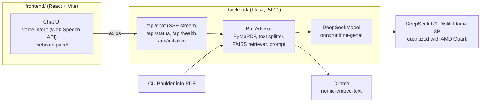

# BuffAdvisor

**A CU Boulder campus assistant that runs a quantized DeepSeek-R1-Distill-Llama-8B model entirely on a local AMD AI PC.** Built at HackCU 2025 (HackCU 11), where it took 1st place in the AMD AI PC track.

Students ask about programs, resources and campus life by typing or speaking. BuffAdvisor retrieves the relevant passages from a CU Boulder information PDF and answers with DeepSeek-R1-Distill-Llama-8B, quantized with AMD Quark and run through ONNX Runtime GenAI on the local machine. No cloud model is involved.

---

## What it does

- **Local LLM inference.** `DeepSeek-R1-Distill-Llama-8B` quantized with AMD Quark (`amd_llm_quantization.ipynb`) and served with `onnxruntime-genai` on hardware acceleration, falling back to CPU if the device can't schedule the model.
- **Retrieval over campus documents.** The PDF is extracted with PyMuPDF, split into 1,000-character chunks, embedded with `nomic-embed-text` through Ollama and indexed in FAISS. Each question pulls the closest chunks into the prompt.
- **Answer styles.** Balanced, brief, detailed or supportive, chosen per request.
- **Streaming responses.** The Flask API streams tokens over Server-Sent Events, with a non-streaming mode that times out after 120 seconds.
- **Voice and camera UI.** The React frontend supports speech input and spoken replies through the Web Speech API, alongside a webcam panel.

---

## Architecture



---

## Tech stack

- **Model and inference:** DeepSeek-R1-Distill-Llama-8B, AMD Quark (quantization), ONNX Runtime GenAI
- **Retrieval:** LangChain, FAISS, Ollama embeddings (`nomic-embed-text`), PyMuPDF
- **Backend:** Python, Flask, Flask-CORS
- **Frontend:** React 19, Vite 6, Tailwind CSS 4, Axios, react-webcam, Web Speech API

---

## Repository layout

```
amd_llm_quantization.ipynb   Colab notebook: install AMD Quark and quantize DeepSeek-R1-Distill-Llama-8B
backend/
  bot.py                     RAG pipeline, DeepSeek ONNX wrapper, interactive CLI
  server.py                  Flask API (chat with SSE streaming, status, health, initialize)
  run_model.py               minimal onnxruntime-genai generation loop
  requirements.txt
frontend/
  src/components/Chatbox.jsx chat, voice input and output, webcam
  src/api/buffAdvisor.js     API client
```

---

## Run it locally

The backend was built for a Windows AMD AI PC with the quantized model exported for ONNX Runtime GenAI.

### 1. Quantize the model

Run `amd_llm_quantization.ipynb` (written for Google Colab) to install AMD Quark and quantize `deepseek-ai/DeepSeek-R1-Distill-Llama-8B`. The notebook exports Hugging Face format; the backend loads an ONNX Runtime GenAI model folder, and that conversion step is not included in this repo. The model path is set in `backend/bot.py` (`model_path` in `initialize_advisor`, `LangChain` and `BuffAdvisor`); update it to your folder.

### 2. Backend

```bash
cd backend
pip install flask flask-cors
pip install -r requirements.txt
ollama pull nomic-embed-text      # embedding model, with Ollama running
```

Put a CU Boulder information PDF in `backend/` (the server uses the first `.pdf` it finds), then:

```bash
python server.py                  # http://localhost:5001
```

`python bot.py` starts an interactive terminal chat instead of the API.

### 3. Frontend

```bash
cd frontend
npm install
npm run dev                       # http://localhost:5173
```

The client calls `http://localhost:5001/api` by default; set `VITE_API_URL` in `frontend/.env` to change it. Endpoint details are in [`backend/backend_README.md`](backend/backend_README.md).
